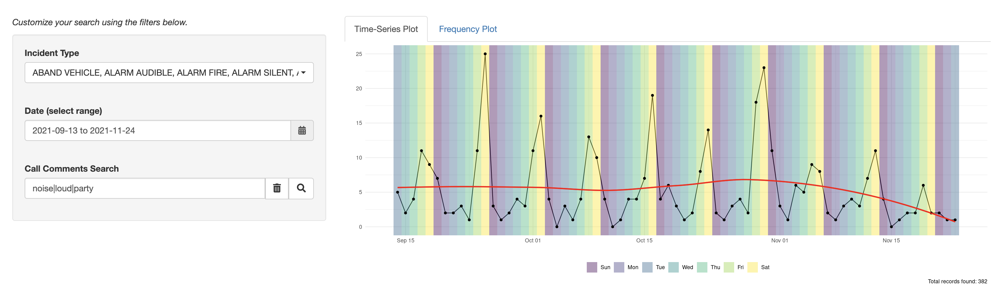
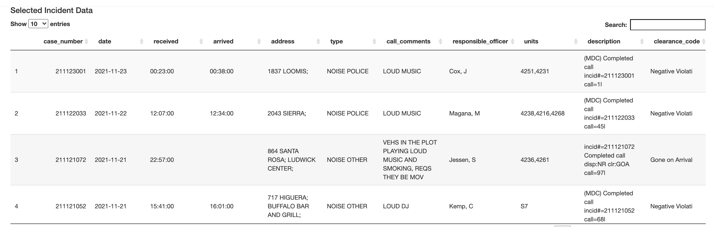
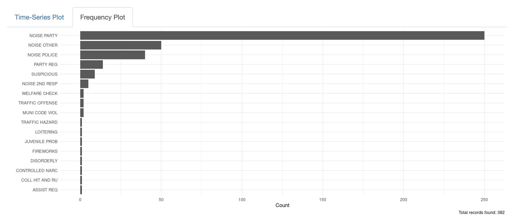
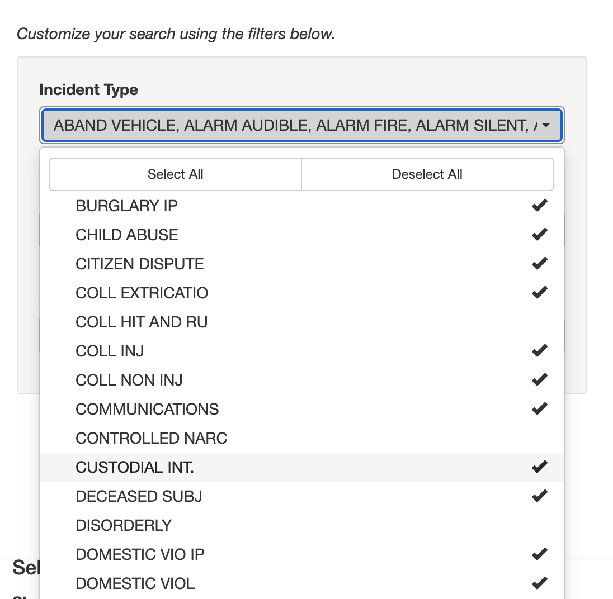
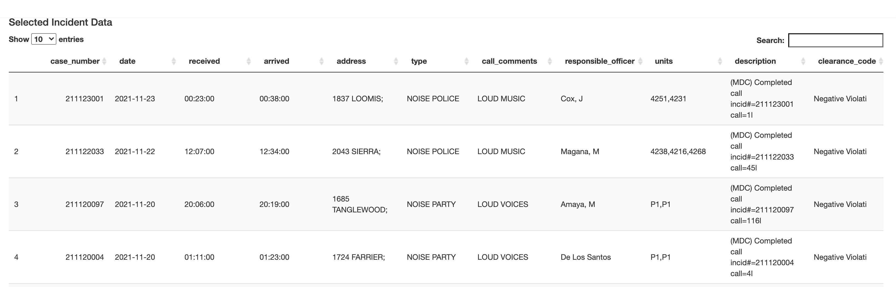
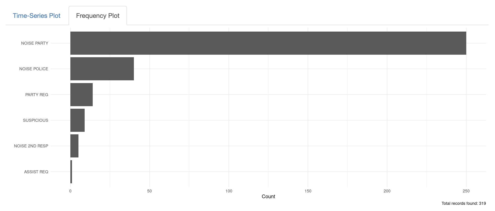
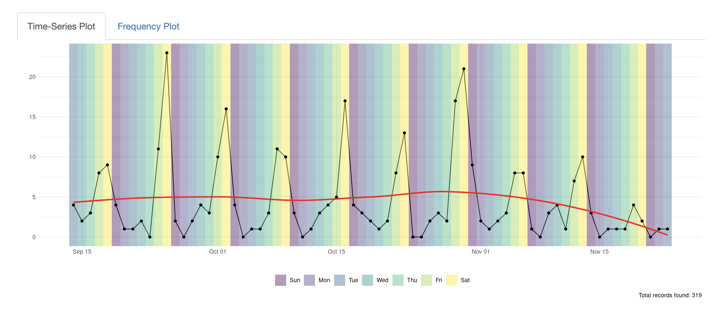

# SLOPD Call Log Dashboard

This simple shiny dashboard was designed to allow for investigation of SLOPD Call Log data. 
In particular, for finding patterns of various types of behavior/incidents.

## Interactive Dashboard 

[https://logan-lossing.shinyapps.io/slopd_activity/](https://logan-lossing.shinyapps.io/slopd_activity/)

## Data Source

The data source is available at [here](https://github.com/nagol/SLOPD_data). The data is updated Monday-Thursday afternoon.

## How to Use

This simple tool was originally designed to make it easy to look for patterns in the call data. When looking at the raw data there are many potential fields to explore. With experience, it seemed that the most useful field was the unstructured Call Comments input by the 911 operator (`call_comments`). Though the SLOPD data is categorized by `type` the labels can often seem random or be in classified in some unexpected way. Thus, the main function of this tool is to allow searching (and allowing *regular expressions*) for words associated with the call `type` you might be looking for.

Once you have a search that seems to return reasonable matches then the time series plot will visualize the frequency over time and the frequency bar chart will provide the 20 most common call `type` labels associated with the search. I have found filtering by `type`

In general, I have found filtering by `date` to be basically useless and the `airDatePicker` html widget is awkward at best.

### Example - Noise Complaints due to Parties

San Luis Obispo is home to a university not unfamiliar with partying. How many complaints relating to parties are the SLOPD responding to? Are there any noticable trends in these data?

#### By Call Comments Search

Consider words that often might be associated with a complaint about a loud party. Words like *noise*, *loud*, and *party* should be good indicators.

Let's try the search phrase `noise|loud|party`

Looks like we have found many results. Are these the results we really want?

We can probe further by looking at the raw data and the `type` breakdown plot.

Note, the search functionality in the table can be used to find specific calls
within the data without changing the result set. This can be very handy to quickly
investigate anomalies in the result set.

#### By Type

What were the labels applied by SLOPD to these calls? That is where this plot shines. In this example, these call `type` labels all seem appropriate and related but this is not always the case. 

In this `type` breakdown, there are many categories that I do not think are related
to what we are looking for. Use the `type` selector to unselect the offending records.

#### Results

Finally, we have filtered for just the records we were looking for. Now that
we know what a reasonable filter is, further analysis can be done on remaining
fields such as time-of-day and location information.

In the final time-series plot, we see clear evidence of weekly seasonality.
Party related noise complaints peak on Friday and Saturday.

